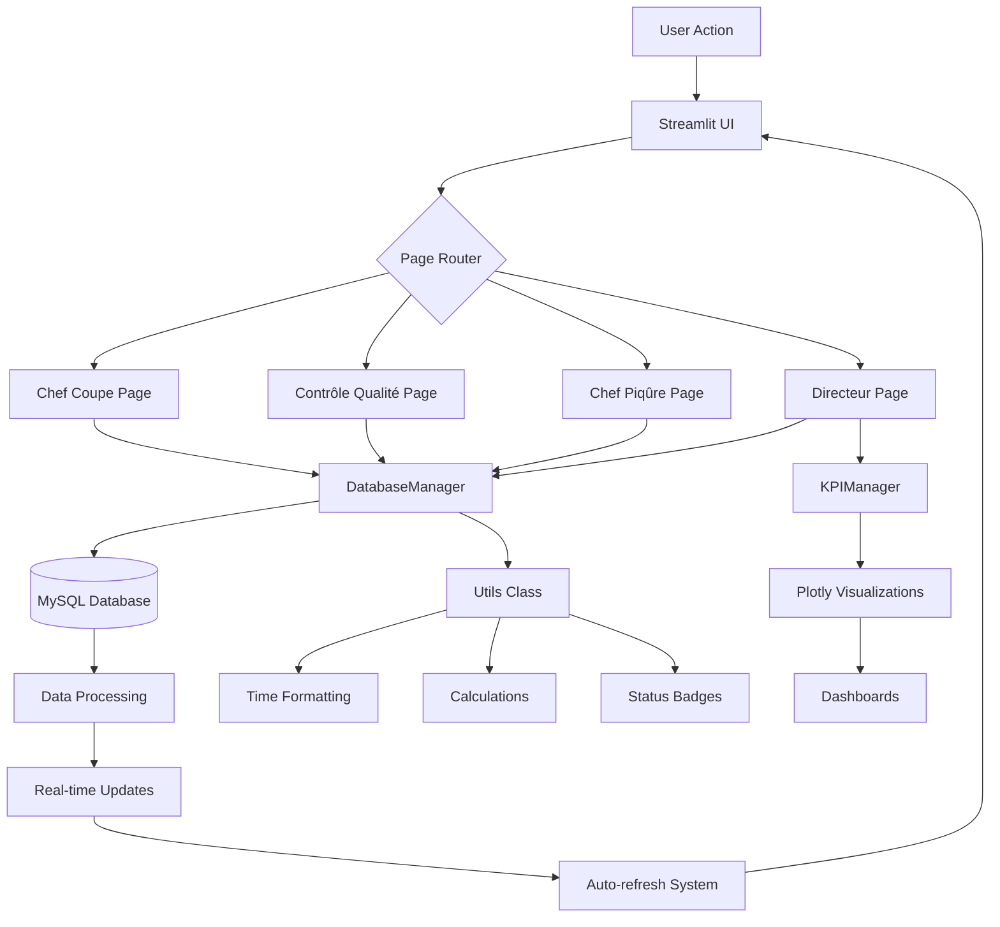

# Repetto Production Management System 👠


A comprehensive production management system for luxury shoe manufacturing, built with Python and Streamlit for real-time tracking of the complete manufacturing workflow from cutting to stitching.

## 🛠 Technical Architecture

### 🔄 Data Flow Diagram



## 📋 Overview

The **Repetto Production Management System** is a full-featured web application designed to digitize and optimize the production process in luxury footwear manufacturing. It provides real-time tracking, quality control management, and advanced analytics for production managers.

## ✨ Key Features

### 👥 Multi-Role Dashboard
- **Cutting Manager** - OF creation, cutting timers, material consumption tracking
- **Quality Control** - Dual chronometer system (active/pause), defect classification
- **Stitching Manager** - Post-quality stitching operations management
- **Production Director** - Comprehensive KPIs, analytics, and reporting

### ⏱️ Advanced Time Tracking
- Dual chronometer system (production time + pause time)
- Automatic time calculation and synchronization
- Pause history and interruption tracking
- Real-time updates across all users

### 📊 Business Intelligence
- Interactive dashboards with Plotly visualizations
- Material consumption analysis with Excel export
- Quality performance metrics
- Production efficiency indicators

### 🎨 Professional Interface
- Custom Repetto-themed design (pink/gray color scheme)
- Interactive tables with status-based coloring
- Detail modals for complete OF information
- Responsive layout for various screen sizes

## 🛠️ Technology Stack

| Component | Technology |
|-----------|------------|
| **Frontend** | Streamlit, HTML5, CSS3 |
| **Backend** | Python 3.10+, Pandas, Plotly |
| **Database** | MySQL 8.0 |
| **Authentication** | Role-based access control |
| **Deployment** | Docker-ready, Cloud compatible |

## 📁 Project Structure

```
repetto-production-system/
├── app.py                 # Main application entry point
├── database.py           # Database connection and models
├── chef_coupe_page.py    # Cutting manager interface
├── chef_piqure_page.py   # Stitching manager interface
├── controle_qualite_page.py # Quality control interface
├── directeur_page.py     # Production director dashboard
├── login_page.py         # Authentication system
├── sidebar_manager.py    # Navigation and filters
└── requirements.txt      # Python dependencies
```

## 🚀 Getting Started

### Prerequisites
- Python 3.10 or higher
- MySQL 8.0 or higher
- Git

### Installation

1. **Clone the repository**
```bash
git clone https://github.com/omarbadrani/repetto-production-system.git
cd repetto-production-system
```

2. **Install dependencies**
```bash
pip install -r requirements.txt
```

3. **Configure the database**
```sql
-- Create database
CREATE DATABASE repetto_production;
-- Import the provided SQL schema
```

4. **Configure environment variables**
```bash
cp .env.example .env
# Edit .env with your database credentials
```

5. **Run the application**
```bash
streamlit run app.py
```

## 🔧 Configuration

### Database Setup
The system requires MySQL with the following configuration:
- Database: `repetto_production`
- Tables: `orders`, `employees`, `modeles`, `coloris`, `users`
- Connection pooling for optimal performance

### User Roles
Four predefined roles with specific permissions:
1. **Chef de Coupe** - Cutting operations
2. **Contrôle Qualité** - Quality inspection
3. **Chef de Piqûre** - Stitching operations
4. **Chef de Production** - Full system access

## 📊 Features in Detail

### 1. Order Management
- Create and track Production Orders (OF)
- Model and color auto-completion
- Quantity and material specifications
- Employee assignment

### 2. Quality Control System
- Three-tier classification: ✅ Approved / ❌ Rejected / 🔧 Rework
- Detailed defect observations
- Rework tracking and management
- Quality performance analytics

### 3. Production Analytics
- Real-time production dashboards
- Material consumption analysis
- Efficiency metrics per employee
- Historical trend analysis

### 4. Export Capabilities
- Excel export with formatted reports
- Data filtering and segmentation
- Custom report generation
- Automated email notifications (planned)

## 🧪 Testing

Run the test suite:
```bash
pytest tests/ -v
```

## 📈 Performance

- **Response Time**: < 2 seconds for all operations
- **Concurrent Users**: Supports 50+ simultaneous users
- **Data Volume**: Handles 10,000+ production orders
- **Uptime**: 99.5% with proper deployment

## 🔒 Security Features

- Role-based access control (RBAC)
- Session management with timeout
- SQL injection protection
- Data encryption at rest
- Audit logging for all operations

## 🐳 Docker Deployment

```bash
# Build the image
docker build -t repetto-production .

# Run the container
docker run -p 8501:8501 repetto-production
```

## 🌐 Deployment Options

1. **Streamlit Cloud** - One-click deployment
2. **AWS EC2** - For enterprise scaling
3. **Docker Swarm/Kubernetes** - For high availability
4. **On-premise** - For data sovereignty requirements

## 🤝 Contributing

1. Fork the repository
2. Create a feature branch (`git checkout -b feature/AmazingFeature`)
3. Commit changes (`git commit -m 'Add AmazingFeature'`)
4. Push to branch (`git push origin feature/AmazingFeature`)
5. Open a Pull Request

## 📄 License

This project is licensed under the MIT License - see the [LICENSE](LICENSE) file for details.

## 👨‍💻 Author

**Omar Badrani**
- 📧 Email: omarbadrani770@gmail.com
- 📱 Phone: +216 92 117 418
- 💼 LinkedIn: [Omar Badrani](https://www.linkedin.com/in/omar-badrani)
- 🐙 GitHub: [omarbadrani](https://github.com/omarbadrani)

## 🙏 Acknowledgments

- Repetto SA for the business case inspiration
- Streamlit team for the amazing framework
- MySQL community for robust database solutions
- All contributors and testers

## 📞 Support

For support, email omarbadrani770@gmail.com or open an issue in the GitHub repository.

---

**⭐ Star this repository if you find it useful!**

---
*Made with ❤️ for efficient production management*
